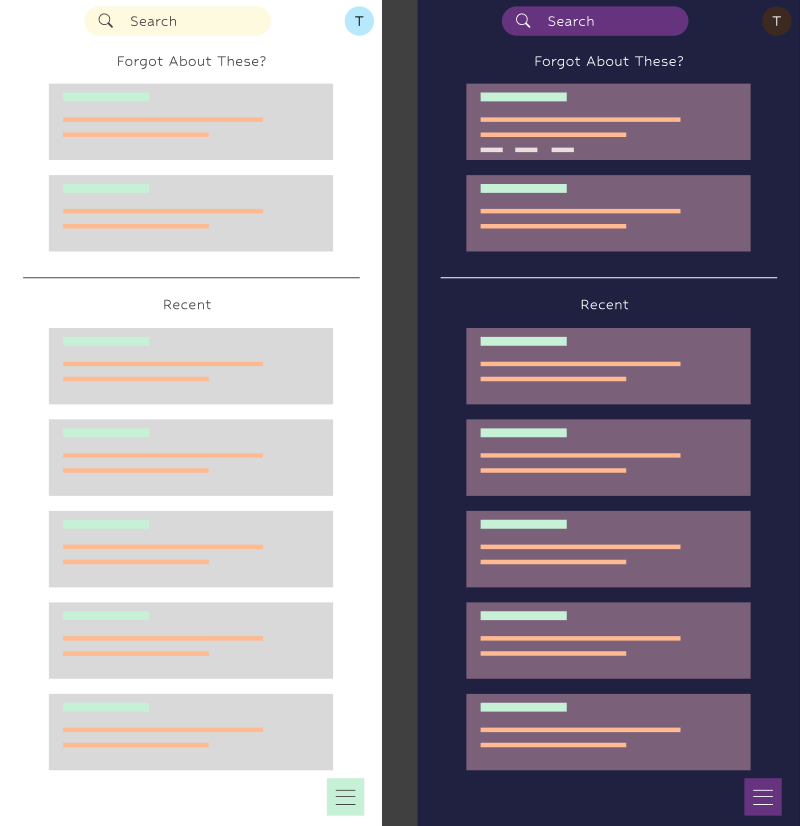

# Memora
Memora is a note-taking app designed for forgetful people who need help remembering important information. With built-in reminders and an intuitive interface, Memora makes it easy to capture and organize your thoughts, ideas, to-do lists, tasks, and events.

# Features
- Intuitive interface for easy note-taking and organization
- Built-in reminders to help you remember important information
- Synchronization with Firebase for easy access to your notes and reminders from anywhere
- Plans to package the app as a native application for enhanced performance and functionality

# Deployment
Memora is currently under development and will be available on the web soon.

Note: Memora's native mobile application will be available in the future.

# Installation
To install Memora, follow these steps:

1. Clone the repository to your local machine.
2. Install the necessary dependencies by running `npm install`.
3. Create a new Firebase project and configure your app's settings.
4. Add your Firebase SDK configuration to the `firebase.js` file in the `src` folder.
5. Start the app by running `npm run dev`.
Note: To add your Firebase SDK configuration, follow these steps:

1. Go to your Firebase project's settings and click on "Add Firebase to your web app".
2. Copy the config object that appears.
3. Open the `firebase.js` file in the `src` folder.
4. Replace the existing config object with the one you copied from Firebase.

# Usage
To use Memora, simply open the app and start taking notes. You can add reminders to your notes by setting a date and time, and Memora will send you a notification when it's time to remember. You can also search for specific notes using the search bar.

# Contributing
We welcome contributions from the community! If you find a bug or have a suggestion for a new feature, please submit an issue or a pull request. Please review our code of conduct and contributing guidelines before getting started.

# License
Memora is released under the MIT License. Please see the license file for more information.

# Contact
If you have any questions or comments about Memora, please contact us at [tuckermcraig@gmail.com](mailto:tuckermcraig@gmail.com) or [TuckTuckC](https://github.com/TuckTuckC).
